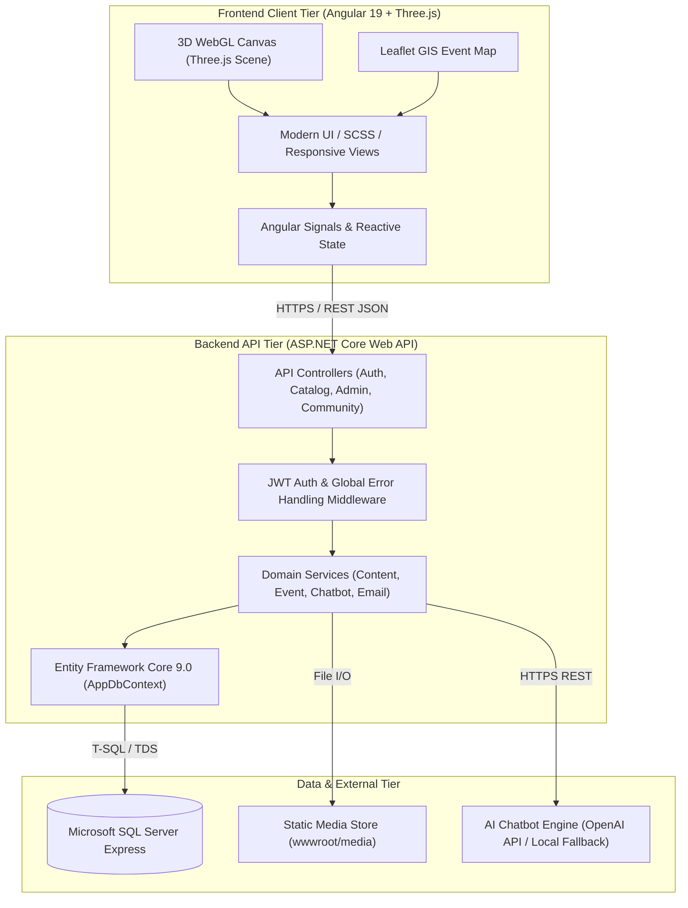
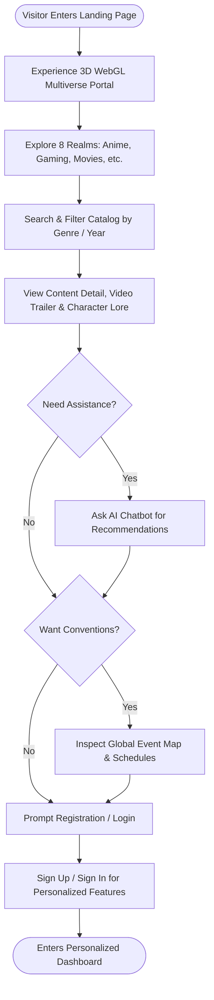
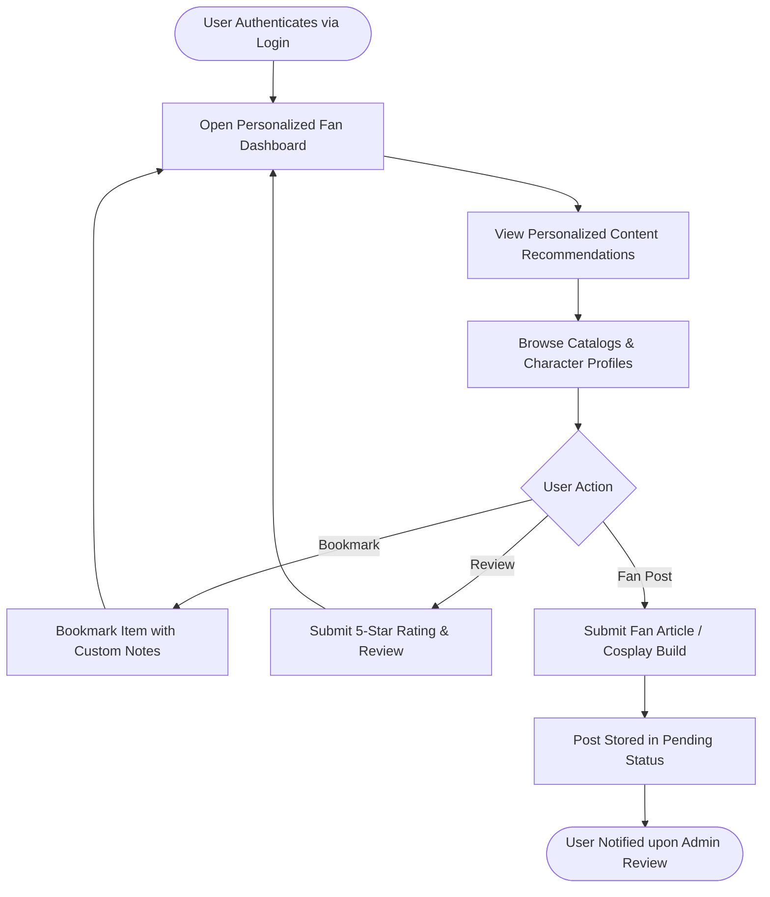
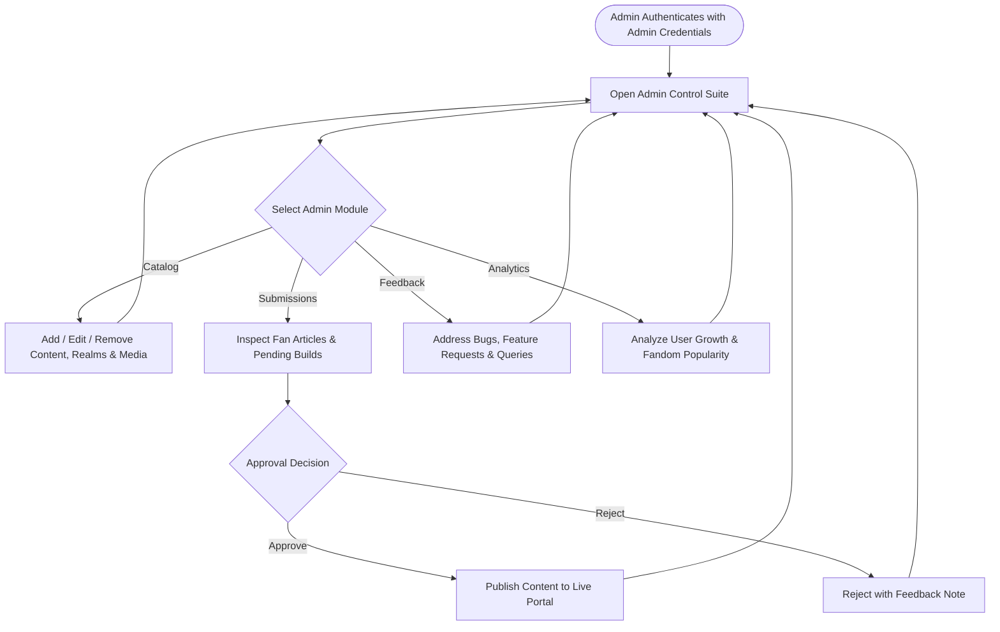
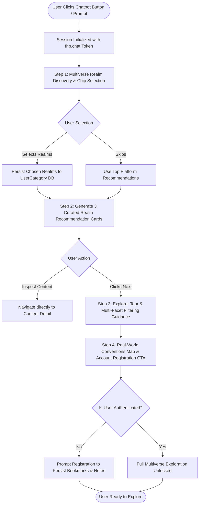
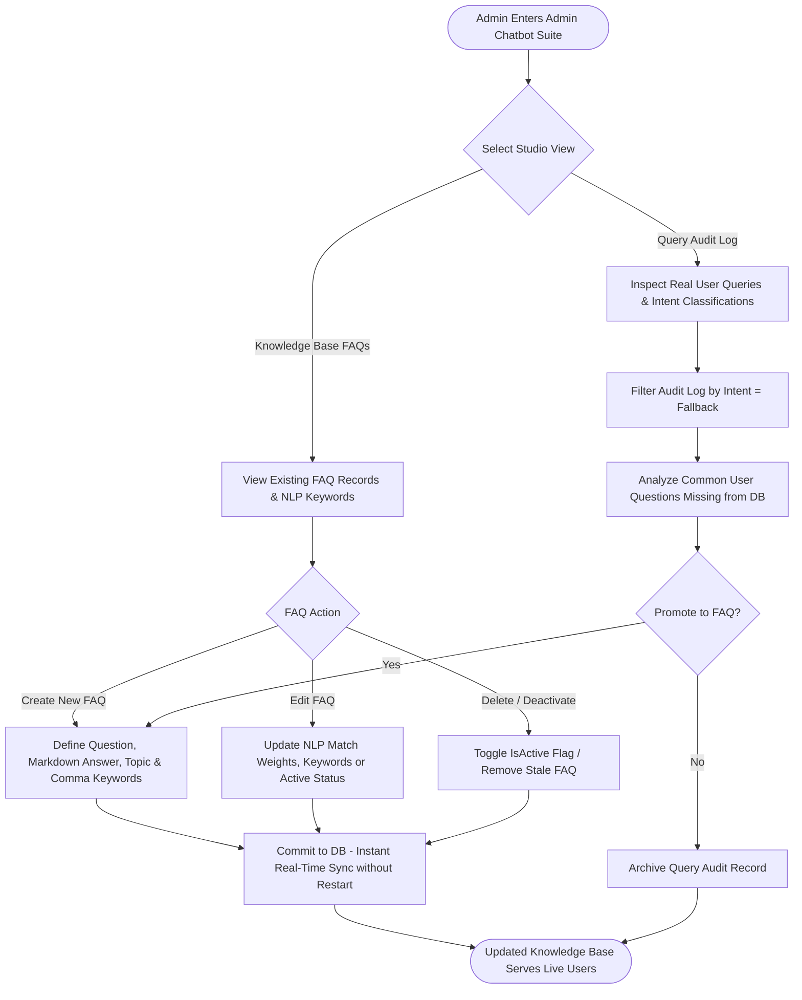
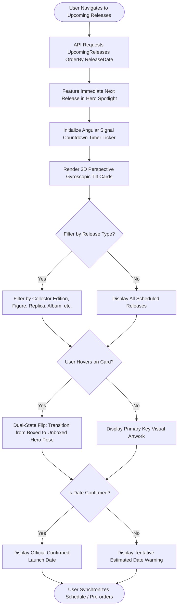
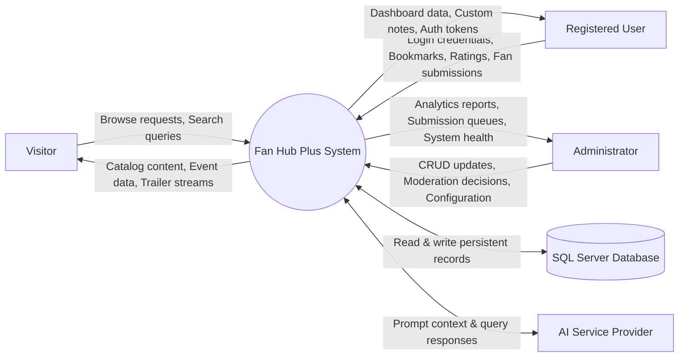
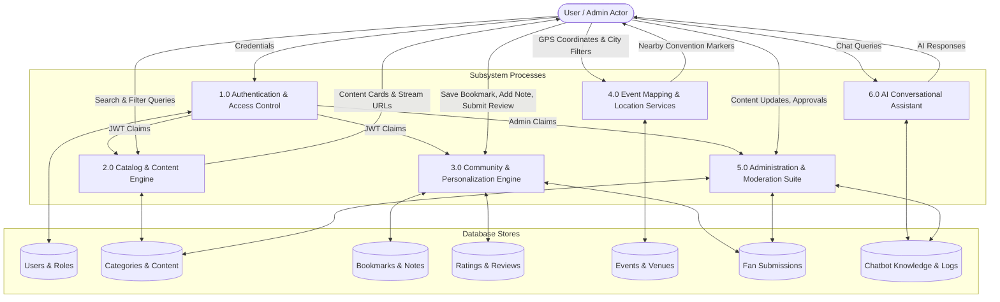
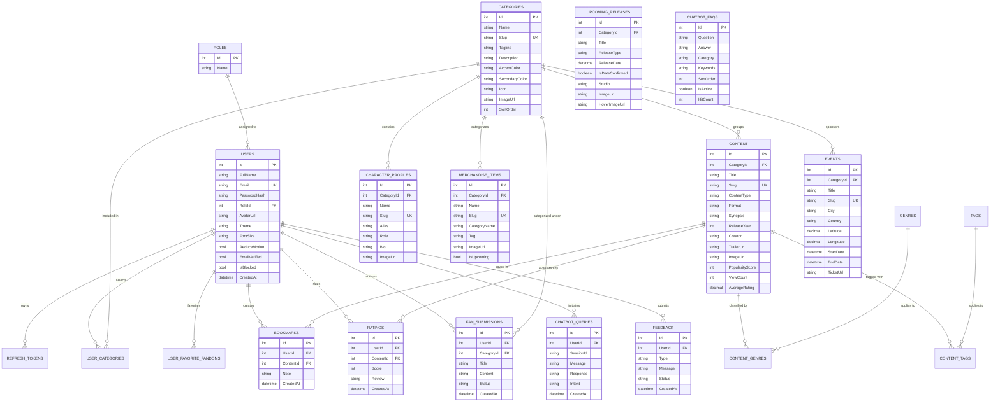

# FANDOM UNIVERSE: FAN HUB PLUS
## Comprehensive Project Documentation & Software Requirements Specification (SRS)
**Competition / Event:** TechWiz 7 &mdash; The World Tech Championship  
**Category:** End-to-End Web Solutions  
**Theme:** Fandom Universe (Portal for Fans)  
**Document Version:** 1.0 Final  
**Organization:** Aptech Limited  

---

## Table of Contents
- [1.1 Background and Necessity for the Web Application](#11-background-and-necessity-for-the-web-application)
- [1.2 Proposed Solution](#12-proposed-solution)
- [1.3 Purpose of the Document](#13-purpose-of-the-document)
- [1.4 Scope of the Project](#14-scope-of-the-project)
- [1.5 System Assumptions and Constraints](#15-system-assumptions-and-constraints)
  - [1.5.1 Project Assumptions](#151-project-assumptions)
  - [1.5.2 System Constraints](#152-system-constraints)
- [1.6 Functional Requirements](#16-functional-requirements)
  - [1.6.1 User Authentication and Management](#161-user-authentication-and-management)
  - [1.6.2 Personalized Dashboard](#162-personalized-dashboard)
  - [1.6.3 Fandom Content Explorer (Advanced Filters & Sorting)](#163-fandom-content-explorer-advanced-filters--sorting)
  - [1.6.4 AI-Powered Chatbot Assistant & Multi-Step Onboarding Flow](#164-ai-powered-chatbot-assistant--multi-step-onboarding-flow)
  - [1.6.5 Interactive Multimedia Center](#165-interactive-multimedia-center)
  - [1.6.6 Character Profiles & Featured Articles Hub](#166-character-profiles--featured-articles-hub)
  - [1.6.7 Merchandise Showcase & Resource Library](#167-merchandise-showcase--resource-library)
  - [1.6.8 Upcoming Releases & Pre-Launch Countdown Hub](#168-upcoming-releases--pre-launch-countdown-hub)
  - [1.6.9 User Feedback and Ratings System](#169-user-feedback-and-ratings-system)
  - [1.6.10 Bookmarking, Custom Notes, and Sharing](#1610-bookmarking-custom-notes-and-sharing)
  - [1.6.11 Location-Aware Event Discovery & Interactive Calendar](#1611-location-aware-event-discovery--interactive-calendar)
  - [1.6.12 Administration Control Panel & Knowledge Base Management](#1612-administration-control-panel--knowledge-base-management)
  - [1.6.13 Accessibility & Immersive UI/UX Enhancements](#1613-accessibility--immersive-uiux-enhancements)
- [1.7 Non-Functional Requirements](#17-non-functional-requirements)
- [1.8 Interface Requirements](#18-interface-requirements)
  - [1.8.1 Hardware Interfaces](#181-hardware-interfaces)
  - [1.8.2 Software Interfaces](#182-software-interfaces)
  - [1.8.3 Communications Interfaces](#183-communications-interfaces)
- [1.9 Project Deliverables & Technical Architecture](#19-project-deliverables--technical-architecture)
  - [1.9.1 Problem Definition](#191-problem-definition)
  - [1.9.2 System Architecture & Design Specifications](#192-system-architecture--design-specifications)
  - [1.9.3 Activity Flowcharts](#193-activity-flowcharts)
  - [1.9.4 Data Flow Diagrams (DFD Level 0 & Level 1)](#194-data-flow-diagrams-dfd-level-0--level-1)
  - [1.9.5 Entity-Relationship (ER) Diagram](#195-entity-relationship-er-diagram)
  - [1.9.6 Database Relational Schema Specification](#196-database-relational-schema-specification)
  - [1.9.7 Test & Seed Data Used in the Project](#197-test--seed-data-used-in-the-project)
  - [1.9.8 Project Installation Instructions (MANDATORY)](#198-project-installation-instructions-mandatory)
  - [1.9.9 User Credentials for all Roles (MANDATORY)](#199-user-credentials-for-all-roles-mandatory)
  - [1.9.10 Interactive Sitemap & Application Flow](#1910-interactive-sitemap--application-flow)
  - [1.9.11 Ethical AI Usage Statement](#1911-ethical-ai-usage-statement)
  - [1.9.12 Project Source Code Structure & Implementation File Manifest](#1912-project-source-code-structure--implementation-file-manifest)

---

## 1.1 Background and Necessity for the Web Application

A fandom is a dynamic, culturally vibrant global community of passionate enthusiasts bound by their shared appreciation of creative universes. Today, fandom communities encompass millions of active fans across eight interconnected domains:
1. **Anime** (Shonen, Seinen, Isekai, Mecha, Shojo)
2. **Gaming** (Esports, RPGs, Action-Adventure, Indie titles)
3. **Movies** (Cinematic universes, Blockbusters, Cult classics)
4. **TV Shows** (Episodic dramas, Streaming series, Animated sagas)
5. **Korean Pop (K-Pop)** (Idol groups, Comebacks, MV releases, Discography)
6. **Comics** (Western Graphic Novels, Superhero lore, Indie comic runs)
7. **Manga** (Serialized Japanese graphic narratives, Tankobon volumes)
8. **Cosplay** (Prop craft, Armor construction, Masquerades, Conventions)

### The Existing Industry Problem
Despite immense fandom engagement worldwide, fans currently navigate a severely fragmented and subpar digital landscape:
- **Scattered Resources:** Information is dispersed across unmoderated message boards, disconnected social media silos, wikis cluttered with intrusive advertisements, and niche single-fandom forums.
- **Lack of Multimedia Depth:** Existing aggregators offer static, uninspired text-and-thumbnail layouts rather than high-definition trailers, original soundtracks, 3D WebGL realm stages, and interactive character showcases.
- **Fragmented Event Tracking:** Conventions, cosplay gatherings, and movie screenings are promoted haphazardly on different regional ticketing sites without centralized, location-aware GPS discovery.
- **Absence of Unified Multiverse Identity:** A fan who loves both Anime (*Dragon Ball*) and Gaming (*Elden Ring*) or Western Comics (*Captain America*) must maintain multiple accounts across disparate websites with no unified dashboard or cross-fandom recommendation engine.

### The Necessity
There is an urgent demand for a consolidated, visually spectacular, high-performance information super-hub. The application must unite all eight major fandom realms under one cohesive digital ecosystem, offering curated content, deep search/filtering, rich audio-visual streaming, interactive 3D WebGL realm stages, location-aware convention maps, community submissions, and an intelligent AI assistant.

---

## 1.2 Proposed Solution

To resolve this fragmentation, **Fan Hub Plus** is designed and implemented as an enterprise-grade, end-to-end web platform tailored for pop culture enthusiasts, casual visitors, and platform administrators.

### Core Solution Architecture
- **Unified Multiverse Hub:** Eight designated "Realms" (Anime, Gaming, Movies, TV Shows, K-Pop, Comics, Manga, Cosplay), each styled with unique visual branding, custom color palettes, audio-visual media, and interactive 3D WebGL stages.
- **3D WebGL Realm Stages:** Powered by Three.js, incorporating volumetric real-time character models (including a 3D-sculpted Super Saiyan God Goku with normal mapping, God Ki particle vortex, dynamic lighting, and Captain America), interactive cosmic portals, and reactive camera journeys.
- **Fandom Content Explorer:** Instant multi-facet search across categories, genres, release years, tags, content formats, and popularity ratings.
- **Interactive Multimedia Center:** Seamless streaming of video trailers, podcasts, musical OSTs, and cosplay crafting video explainers with an interactive rating engine.
- **Location-Aware Event Calendar:** Leaflet-powered GIS mapping displaying global fan conventions, Comic-Cons, cosplay meetups, and midnight premieres with GPS distance calculation and external ticket links.
- **AI-Powered Chatbot Assistant:** A conversational assistant capable of answering platform inquiries, providing intelligent personalized content recommendations, and tracking conversational context.
- **Personalized Fan Dashboard:** Secure user hub featuring custom favorite fandom badges, recently visited content, personal bookmarks with custom notes, avatar personalization, and fan submission tracking.
- **Admin Control Suite:** End-to-end administration console for managing categories, catalog items, media assets, characters, merchandise galleries, review approvals of fan submissions, and live system analytics.

---

## 1.3 Purpose of the Document

The purpose of this Software Requirements Specification (SRS) is to establish an exhaustive technical and functional blueprint of the **Fan Hub Plus** application. This document:
1. Defines all business, functional, and non-functional requirements.
2. Specifies the technical architecture, database schemas, and interface standards.
3. Provides architectural activity flowcharts, Data Flow Diagrams (DFDs), and Entity-Relationship Diagrams (ERDs).
4. Delivers clear installation procedures and user credential directories.
5. Formulates the baseline for evaluation by judges and stakeholders for the TechWiz 7 World Tech Championship.

---

## 1.4 Scope of the Project

Fan Hub Plus delivers a unified information, multimedia, and community portal for fandom communities worldwide.

### User Roles & Permissions Matrix
The system recognizes three primary tiers of actors:

| Feature / Module | Visitor (Guest) | Registered User | Administrator |
| :--- | :---: | :---: | :---: |
| **Browse Multiverse Realms & Landing Pages** | Full Access | Full Access | Full Access |
| **Search, Filter & Sort Catalog Content** | Full Access | Full Access | Full Access |
| **Stream Multimedia (Trailers, Video, Audio)** | Full Access | Full Access | Full Access |
| **Explore Character Profiles & Event Highlights** | Full Access | Full Access | Full Access |
| **View Global Event Map & Calendar** | Full Access | Full Access | Full Access |
| **Interact with AI Chatbot Assistant** | Full Access | Full Access | Full Access |
| **User Registration & Profile Creation** | Allowed | Active | Active |
| **Rate & Review Content (5-Star / Thumbs Up)** | Read Only | Create / Update | Full Moderation |
| **Personalized Fan Dashboard** | No Access | Full Access | Full Access |
| **Bookmarking with Custom Notes** | No Access | Full Access | Full Access |
| **Submit Fan Articles & Cosplay Builds** | No Access | Create (Pending) | Review / Approve |
| **Content CRUD Management (Categories, Media)**| No Access | No Access | Full Control |
| **User & Account Management (Block/Verify)** | No Access | No Access | Full Control |
| **System Analytics & Activity Logs** | No Access | No Access | Full Control |

---

## 1.5 System Assumptions and Constraints

### 1.5.1 Project Assumptions

The architecture, system design, data models, and operation of **Fan Hub Plus** are grounded in the following foundational assumptions:

1. **Client Computing & Browser Environment:**
   - Evaluators, administrators, and users access the platform using modern evergreen web browsers (Google Chrome 110+, Microsoft Edge 110+, Mozilla Firefox 115+, Apple Safari 16+) with JavaScript/ECMAScript 2022 enabled.
   - Hardware-accelerated WebGL 2.0 is supported by the client GPU/graphics driver to render interactive Three.js 3D character stages and cosmic particle effects.
   - Client displays range from responsive mobile viewports (minimum 375px width) to standard desktop/laptop displays (1920x1080) and 4K ultra-wide monitors.

2. **Network Infrastructure & Hosting Environment:**
   - The application functions seamlessly in both local deployment (localhost loopback via `http://localhost:4200` frontend and `http://localhost:5080` API) and distributed cloud environments.
   - Network connectivity allows standard HTTP/HTTPS RESTful JSON exchanges between the Angular client and ASP.NET Core Web API.

3. **Database Server Availability:**
   - Microsoft SQL Server (2019, 2022, or SQL Server Express / LocalDB) is installed and active on the host machine.
   - Standard relational integrity, ACID transaction guarantees, cascade delete rules, and foreign key constraints are natively supported and enforced by the SQL Server engine.

4. **Non-Transactional Merchandise & Fandom Resources Scope:**
   - In accordance with TechWiz 7 competition guidelines, the Merchandise Showcase is strictly informational, serving as an interactive discovery gallery and fan wishlist collector. **No financial transactions, payment gateway integrations (e.g., Stripe, PayPal), checkout carts, or banking data processing are implemented.**

5. **Static Media Delivery & Asset Management:**
   - High-definition media assets (character renders, promotional banners, anime video trailers, MP3 podcast episodes, cosplay guides) are stored and served locally by the ASP.NET Core static files middleware (`wwwroot/`) ensuring complete offline/local testability without dependency on paid external CDNs.

6. **Authentication & Demonstration Credential Pre-seeding:**
   - Pre-configured user roles (Administrator, Registered Fan, Creator) are seeded in the database with known demonstration credentials to allow frictionless evaluation of permission tiers. Passwords are securely hashed using PBKDF2 with SHA-256 and HMAC.

### 1.5.2 System Constraints

1. **Device & Browser Compatibility:** The platform must execute seamlessly across modern web browsers (Google Chrome 110+, Mozilla Firefox 115+, Microsoft Edge 110+, Apple Safari 16+) with responsive scaling across mobile, tablet, laptop, and ultra-wide desktop viewports.
2. **Merchandise Discovery Constraint:** In strict adherence to competition rules, the merchandise showcase is exclusively for discovery, cataloging, and collection tracking. **No e-commerce transaction processing, payment gateways, or cart checkout functionality** are included.
3. **Media Handling & Storage:** Fandom assets (images, audio clips, video loops) must adhere to fair-use guidelines, utilizing optimized WebP, WebM, and MP4 compression standards to ensure minimal bandwidth consumption and sub-second page delivery.
4. **Data Integrity & Referential Constraints:** Relational constraints (cascading deletes, foreign key referential integrity, unique indices) must be enforced within Microsoft SQL Server.
5. **Session & Token Lifecycles:** Stateless JWT access tokens are constrained to a 30-minute validity window, paired with cryptographically secure, database-backed refresh tokens having 7-day sliding expiration.

---

## 1.6 Functional Requirements

### 1.6.1 User Authentication and Management
- **Registration & Login:** Secure account onboarding capturing user full name, email, and password. Passwords are encrypted utilizing industry-standard cryptographic hashing (Argon2 / PBKDF2 with SHA-256).
- **Session Management:** Secure stateless JWT authentication emitting signed Bearer tokens containing user ID, email, role claim, and expiration timestamps.
- **Password Reset & Verification:** Tokenized password recovery workflow generating unique, cryptographically hashed tokens sent via SMTP email service or simulated local mail delivery.
- **User Profile Personalization:** Users can select favorite fandoms, preferred realm categories, customize display themes (Dark / Light / High Contrast), adjust font scaling (`sm`, `md`, `lg`), toggle motion reduction, and upload custom avatars.

### 1.6.2 Personalized Dashboard
- **Welcome Overview:** Displays dynamic greeting, member badge, and account verification status.
- **Activity & Recommendations:** Feeds tailored content recommendations based on user-selected fandoms and browsing history.
- **My Bookmarks Hub:** Central repository of all saved articles, multimedia clips, characters, and merchandise with personal timestamped notes.
- **Community Submission Tracker:** Live status tracker for fan-submitted content (Pending Review, Approved, Published, Rejected).

### 1.6.3 Fandom Content Explorer (Advanced Filters & Sorting)
- **Multi-Level Querying:** Instant search indexing across titles, synopses, character names, and creator tags.
- **Faceted Filters:** Filter by Realm Category (Anime, Gaming, etc.), Genre (Action, RPG, Sci-Fi, etc.), Release Year range, Content Type (Article, Video, Audio, Gallery), and Format.
- **Dynamic Sorting:** Sort content by Most Popular (view count / rating score), Newest Releases, Alphabetical (A&ndash;Z, Z&ndash;A), and Top User Rated.

### 1.6.4 AI-Powered Chatbot Assistant & Multi-Step Onboarding Flow
- **Guided 4-Step Interactive Onboarding Journey:**
  - *Step 1 (Realm Discovery & Preference Selection):* Welcomes the user with a tailored greeting, introduces the eight multiverse realms (Anime, Gaming, Movies, TV Shows, K-Pop, Comics, Manga, Cosplay), and renders interactive realm selection chips.
  - *Step 2 (Interest Persistence & Recommendation Engine):* Automatically persists the user's chosen realms to their database profile (`UserCategory`), invokes the multi-criteria recommendation engine (`IRecommendationService`), and serves three immediate personalized content cards with quick-navigation buttons.
  - *Step 3 (Explorer & Dashboard Walkthrough):* Explains how to leverage multi-facet filters (genres, release year, popularity sorting) and directs users to their personalized dashboard for tracking saved bookmarks and activity history.
  - *Step 4 (Convention Discovery & Account Unlock):* Highlights the Leaflet GIS Event Explorer and Fan Submission Portal, providing actionable next steps (e.g., prompt for guest visitors to register and unlock full platform capabilities).
- **Hybrid Intent Classification & Routing:**
  - Classifies incoming messages into eight distinct intents: `Onboarding`, `Faq`, `Recommend`, `Search`, `Category`, `Greeting`, `Llm`, and `Fallback`.
  - Deterministic NLP keyword scoring and word stemming match user queries against active knowledge base records, with graceful fallback to optional LLM completion (OpenAI GPT-4o-mini / Gemini) and feedback escalation.
- **Contextual Recommendation Engine:**
  - Detects seed phrases (e.g., "movies like Naruto", "games similar to Elden Ring") to surface cross-realm suggestions, correlating shared categories, genres, and community affinity scores.
- **Session Continuity & Persistent Query Logging:**
  - Maintains conversation context per browser session using unique cryptographic session tokens (`fhp.chat`), while persisting all prompt-response pairs to `ChatbotQueries` for analytics and quality assurance.

### 1.6.5 Interactive Multimedia Center
- **Video & Trailer Streaming:** Custom video player supporting full-screen playback, volume memory, seeking, and auto-pause when out of viewport.
- **Audio & Soundtrack Player:** Embedded audio streamer for theme songs, anime OSTs, and fandom podcasts with waveform visualizers.
- **Rating Engine:** Dual-mode feedback system supporting 5-star granularity and binary Thumbs Up / Thumbs Down counters with anti-spam rate limiting.

### 1.6.6 Character Profiles & Featured Articles Hub
- **Interactive Character Cards:** Rich profiles containing character lore, debut year, powers/abilities, affiliated fandom, category badges, and high-resolution galleries.
- **Editorial Articles:** Long-form journalism and release retrospectives with rich text typography, embedded gallery slides, and interactive release timelines.
- **Fan Submissions:** Community portal allowing registered fans to submit original lore essays, cosplay crafting tutorials, and fan art for admin approval.

### 1.6.7 Merchandise Showcase & Resource Library
- **Showcase Galleries:** Grouped displays of official action figures, collector's editions, apparel, and scale models with high-definition multi-angle imagery.
- **Dynamic Status Flags:** Real-time badge indicators (`Limited Edition`, `Pre-Order`, `Convention Exclusive`, or `Archived`).
- **View Count & Popularity Tracking:** Real-time popularity calculation derived from page impressions, user bookmarks, and direct inquiries.

### 1.6.8 Upcoming Releases & Pre-Launch Countdown Hub
- **Real-Time Chronological Countdown Engine:** Angular Signal-driven live countdown ticker (`CountdownComponent`) actively computing days, hours, minutes, and seconds until global launch date.
- **Spotlight Hero Unit ("Next Up"):** Prominently displays the immediate next impending multiverse release with dynamic CSS variables matching the realm accent color, studio branding, and high-definition wide-angle backdrop.
- **Dual-State Perspective 3D Tilt Cards:** Micro-interaction collectible cards utilizing custom 3D perspective gyroscopic tilt (`TiltDirective`, 6-degree pitch/yaw) with smooth hover flip between standard boxed package visual (`imageUrl`) and unboxed hero pose (`hoverImageUrl`).
- **Schedule Verification & Confirmation Badges:** Explicit visual differentiation between locked release dates and tentative/estimated launch windows (`isDateConfirmed` boolean with custom warning badge).
- **Studio & Licensor Attribution:** Explicit branding for top-tier entertainment studios (CD Projekt Red, Marvel Studios & Sideshow, Bandai Namco & FromSoftware, Toei Animation & MegaHouse, Riot Games, Lucasfilm & Hot Toys).
- **Faceted Category & Type Filtering:** Instant reactive filtering chips across release types (`Collector Edition`, `Action Figure`, `Prop Replica`, `Deluxe Statue`, `Life-Size Sculpture`, `Concert Gear`, `Album & Merch`).

### 1.6.9 User Feedback and Ratings System
- **Structured Feedback Form:** Dynamic modal allowing visitors and registered fans to report bugs, submit feature requests, or propose fandom content additions.
- **Admin Review Queue:** Status progression workflow (`New`, `In Review`, `Resolved`, `Closed`) with admin response notes.

### 1.6.10 Bookmarking, Custom Notes, and Sharing
- **Universal Save Button:** Instant one-click bookmarking for any content card, character profile, or video.
- **Personal Annotations:** Allows users to attach custom notes, viewing reminders, or cosplay craft checklists to any saved item.
- **Native Web Share Integration:** One-click link copying and social sharing with pre-formatted OpenGraph meta cards.

### 1.6.11 Location-Aware Event Discovery & Interactive Calendar
- **Interactive World Map:** Leaflet.js-powered global map plotting major conventions (Anime Expo, San Diego Comic-Con, Gamescom, Seoul K-Pop Festa).
- **Geolocation Filter:** Browser GPS calculation enabling users to find conventions and screening meetups ordered by proximity.
- **Event Calendar & Ticketing Links:** Chronological timeline filterable by month and city, featuring external links to official organizer ticket portals.

### 1.6.12 Administration Control Panel & Knowledge Base Management
- **Admin Knowledge Base (FAQ) Studio (`/admin/faqs`):**
  - Full Create, Read, Update, Delete (CRUD) control over chatbot knowledge items via `AdminFaqsController`.
  - Configurable metadata: Question text, Rich Markdown Answer, Topic/Category grouping, comma-separated NLP Keywords (for fuzzy regex matching and stemming scoring), SortOrder, Active state toggle, and HitCount frequency tracking.
  - Zero-Downtime Hot Sync: Knowledge base updates take effect instantly in the live chatbot matching pipeline without requiring application redeployment or database restarts.
- **Assistant Query Log & Unanswered Desk (`/admin/chatbot-queries`):**
  - Real-time audit log of all queries submitted through the chatbot interface by registered users and anonymous visitors.
  - Intent breakdown filter (`Faq`, `Recommend`, `Search`, `Category`, `Onboarding`, `Greeting`, `Llm`, `Fallback`).
  - Knowledge Gap Intelligence: Administrators can filter by `Fallback` intent to review questions the AI could not answer and promote them into official Knowledge Base FAQs with a single click.
- **Catalog Management:** Full CRUD control over all realms, contents, media, genres, tags, characters, and upcoming releases.
- **Character & Merchandise Studio:** Visual management forms for character lore entries, merchandise showcases, and release status flags.
- **Moderation Workflow:** Dedicated review desk for approving or rejecting fan-submitted articles and user feedback.
- **Analytics Dashboard:** Visual metric cards reporting registered user growth, category distribution, most active fandoms, and chatbot query volume.

### 1.6.13 Accessibility & Immersive UI/UX Enhancements
- **Three.js 3D WebGL Engine:** Dynamic 3D canvas featuring volumetric character models with normal-mapped depth, particle Ki auras, realistic contact ground shadows, dynamic point lights, and mouse parallax tilt.
- **Accessibility Controls:** Integrated dark mode / light mode switch, variable font sizing (`sm`, `md`, `lg`), motion reduction toggle, ARIA semantic tags, and full keyboard navigation.
- **Interactive Sitemap:** Full visual constellation sitemap embedded on the home page for instantaneous visual navigation.

---

## 1.7 Non-Functional Requirements

- **Safe to Use (Safety & Hygiene):** The web application prohibits arbitrary file execution. All file uploads (avatars, submission thumbnails) undergo MIME-type validation, byte signature inspection, randomized file renaming, and storage outside web execution roots.
- **Accessibility (WCAG 2.1 AA Compliance):** All interactive elements feature minimum color contrast ratios of 4.5:1. Semantic HTML5 elements (`<nav>`, `<header>`, `<main>`, `<section>`, `<footer>`) and ARIA labels provide screen-reader support.
- **User-Friendliness & Usability:** Clean visual hierarchy, consistent typography, magnetic micro-interactions, responsive breadcrumbs, and skeleton loading states ensure an effortless user journey.
- **Operability & Reliability:** Graceful error boundaries intercept exceptions, displaying user-friendly fallback states while logging detailed stack traces via Serilog.
- **Performance & Throughput:** Sub-second First Contentful Paint (FCP < 0.8s) and High Time-to-Interactive (TTI < 1.5s). Implements Gzip/Brotli compression, WebP modern image formats, lazy loading of below-the-fold media, and Angular standalone tree-shaking.
- **Scalability & Architecture:** Decoupled client-server architecture utilizing RESTful endpoints in ASP.NET Core with Entity Framework Core database indexing, enabling horizontal scaling under cloud container environments.
- **Security:** Strict CORS policy restricting requests to trusted frontend origins, SQL injection prevention via EF Core parameterization, XSS mitigation through Angular template sanitization, and CSRF protection.
- **Availability:** Architected for 99.9% uptime with stateless API services enabling automated container restarts without session interruption.
- **Cross-Platform Compatibility:** Complete visual and functional parity across Desktop (1920×1080, 1440×900, 1366×768), Tablet (1024×768, 820×1180), and Mobile viewports (430×932, 390×844, 360×800).

---

## 1.8 Interface Requirements

### 1.8.1 Hardware Interfaces
- **Server Hardware (Minimum):**
  - Processor: 64-bit Quad-Core Intel Xeon / AMD EPYC (or Intel Core i5/i7 2.4GHz+)
  - RAM: 8 GB minimum (16 GB recommended for concurrent WebGL asset delivery and SQL Server)
  - Storage: 50 GB available SSD space
  - Network: 100 Mbps full-duplex NIC
- **Client Hardware (Recommended):**
  - Processor: Intel Core i3 10th Gen, Apple Silicon M-series, or modern mobile SoC
  - RAM: 4 GB minimum (8 GB recommended for Three.js 3D WebGL scenes)
  - Display: SVGA monitor (1280×720 minimum, 1920×1080 full HD optimal)
  - Peripherals: Standard keyboard and mouse or multi-touch capacitive screen

### 1.8.2 Software Interfaces
- **Client Tier:**
  - Runtime Environment: Modern Web Browser with WebGL 2.0 support
  - Framework: Angular 19 (Standalone Components, Signals, Reactive Forms)
  - Language: TypeScript 5.5, HTML5, SCSS
  - Graphics & Animation: Three.js 0.168, GSAP 3.12 (ScrollTrigger)
  - Mapping: Leaflet 1.9 with OpenStreetMap tiles
- **Server Tier:**
  - Operating System: Windows 10/11, Windows Server 2022, or Linux (Ubuntu 22.04 LTS)
  - Runtime Environment: .NET 9.0 / .NET 10.0 SDK
  - Framework: ASP.NET Core Web API (C#)
  - ORM: Entity Framework Core 9.0
  - Logging: Serilog with Console & File Rolling Sinks
- **Database Tier:**
  - Relational Database: Microsoft SQL Server 2022 / SQL Server Express
  - Management Tool: SQL Server Management Studio (SSMS) / Azure Data Studio / `sqlcmd`
- **External & AI Interfaces:**
  - AI Engine: OpenAI API (GPT-4o-mini) / Rule-based contextual fallback
  - Mailing System: SMTP MailKit integration (Gmail SMTP / Local development mock)

### 1.8.3 Communications Interfaces
- **Protocol:** HTTP/1.1 and HTTP/2 over TLS 1.3 (HTTPS)
- **Data Exchange Format:** JavaScript Object Notation (JSON)
- **Port Allocations:**
  - Backend API: Port `5080` (HTTP) / `5081` (HTTPS)
  - Frontend Client: Port `4200`
  - SQL Server: Port `1433`

---

## 1.9 Project Deliverables & Technical Architecture

### 1.9.1 Problem Definition
In today's digital media ecosystem, fandom culture is one of the fastest-growing entertainment drivers. However, enthusiasts must navigate dozens of disconnected websites to track news, find character lore, stream trailers, and discover conventions. **Fan Hub Plus** solves this by consolidating all eight major pop-culture realms into a single, high-fidelity web application with 3D interactive visuals, unified search, personalized dashboards, community submissions, and location-aware event tracking.

---

### 1.9.2 System Architecture & Design Specifications

The platform is designed according to a clean, multi-layered architectural model:



---

### 1.9.3 Activity Flowcharts

#### A. Visitor Journey Flowchart


#### B. Registered User Journey Flowchart


#### C. Administrator Content Management Flowchart


#### D. AI Chatbot Guided Onboarding Journey Flowchart


#### E. Administrator Knowledge Base & Query Desk Moderation Flowchart


#### F. Upcoming Releases Discovery & Countdown Flowchart


---

### 1.9.4 Data Flow Diagrams (DFD Level 0 & Level 1)

#### DFD Level 0 (Context Diagram)


#### DFD Level 1 (Decomposition Diagram)


---

### 1.9.5 Entity-Relationship (ER) Diagram



---

### 1.9.6 Database Relational Schema Specification

The production schema is organized into 22 normalized relational tables:

| Table Name | Primary Key | Foreign Keys | Key Attributes & Constraints |
| :--- | :--- | :--- | :--- |
| **`Roles`** | `Id` (INT, Identity) | None | `Name` (NVARCHAR(50), Unique) |
| **`Users`** | `Id` (INT, Identity) | `RoleId` &rarr; `Roles(Id)` | `FullName`, `Email` (Unique), `PasswordHash`, `Theme`, `EmailVerified`, `IsBlocked`, `CreatedAt` |
| **`RefreshTokens`** | `Id` (INT, Identity) | `UserId` &rarr; `Users(Id)` | `TokenHash`, `ExpiresAt`, `CreatedAt`, `RevokedAt` |
| **`PasswordResetTokens`**| `Id` (INT, Identity) | `UserId` &rarr; `Users(Id)` | `TokenHash`, `ExpiresAt`, `UsedAt` |
| **`Categories`** | `Id` (INT, Identity) | None | `Name`, `Slug` (Unique), `Tagline`, `Description`, `AccentColor`, `Icon`, `ImageUrl` |
| **`UserCategories`** | Composite (`UserId`, `CategoryId`) | &rarr; `Users`, `Categories` | Multi-category user preference mapping |
| **`UserFavoriteFandoms`**| `Id` (INT, Identity) | `UserId` &rarr; `Users(Id)` | `Name` (NVARCHAR(100)) |
| **`Genres`** | `Id` (INT, Identity) | None | `Name`, `Slug` (Unique) |
| **`Tags`** | `Id` (INT, Identity) | None | `Name`, `Slug` (Unique), `Color` |
| **`Content`** | `Id` (INT, Identity) | `CategoryId` &rarr; `Categories(Id)` | `Title`, `Slug` (Unique), `ContentType`, `ReleaseYear`, `Creator`, `TrailerUrl`, `AverageRating`, `ViewCount` |
| **`ContentGenres`** | Composite (`ContentId`, `GenreId`) | &rarr; `Content`, `Genres` | Many-to-many content genre classification |
| **`ContentTags`** | Composite (`ContentId`, `TagId`) | &rarr; `Content`, `Tags` | Many-to-many content tagging |
| **`CharacterProfiles`**| `Id` (INT, Identity) | `CategoryId` &rarr; `Categories(Id)` | `Name`, `Slug` (Unique), `Alias`, `Bio`, `ImageUrl` |
| **`MerchandiseItems`** | `Id` (INT, Identity) | `CategoryId` &rarr; `Categories(Id)` | `Name`, `Slug` (Unique), `Tag` (Limited Edition/Pre-Order), `ImageUrl`, `IsUpcoming` |
| **`UpcomingReleases`** | `Id` (INT, Identity) | `CategoryId` &rarr; `Categories(Id)` | `Title`, `ReleaseType`, `ReleaseDate`, `IsDateConfirmed`, `Studio`, `Description`, `ImageUrl`, `HoverImageUrl`, `ExternalUrl`, `ViewCount` |
| **`UpcomingReleaseTags`** | Composite (`UpcomingReleaseId`, `TagId`) | &rarr; `UpcomingReleases`, `Tags` | Many-to-many upcoming release tag taxonomy |
| **`Bookmarks`** | `Id` (INT, Identity) | `UserId` &rarr; `Users`, `ContentId` &rarr; `Content` | `Note` (NVARCHAR(1000)), `CreatedAt` |
| **`Ratings`** | `Id` (INT, Identity) | `UserId` &rarr; `Users`, `ContentId` &rarr; `Content` | `Score` (1&ndash;5), `Review`, `CreatedAt` |
| **`Events`** | `Id` (INT, Identity) | `CategoryId` &rarr; `Categories(Id)` | `Title`, `City`, `Country`, `Latitude`, `Longitude`, `StartDate`, `EndDate`, `TicketUrl` |
| **`FanSubmissions`** | `Id` (INT, Identity) | `UserId` &rarr; `Users`, `CategoryId` &rarr; `Categories` | `Title`, `Content`, `Status` (Pending, Approved, Rejected), `CreatedAt` |
| **`Feedback`** | `Id` (INT, Identity) | `UserId` &rarr; `Users(Id)` (Optional) | `Type` (Bug, Suggestion, Query), `Message`, `Status`, `CreatedAt` |
| **`ChatbotFaqs`** | `Id` (INT, Identity) | None | `Question`, `Answer` (Markdown), `Category`, `Keywords`, `SortOrder`, `IsActive`, `HitCount` |
| **`ChatbotQueries`** | `Id` (INT, Identity) | `UserId` &rarr; `Users(Id)` (Optional) | `SessionId`, `Message`, `Response`, `Intent`, `MatchedFaqId`, `CreatedAt` |

---

### 1.9.7 Test & Seed Data Used in the Project

The application comes pre-populated with realistic, high-fidelity seed data spanning all eight fandom categories:

1. **Realm Categories (8 Complete Realms):**
   - *Anime:* Accent `#E11D48`, Slug `anime`, Features *Dragon Ball*, *Demon Slayer*, *Attack on Titan*.
   - *Gaming:* Accent `#22C55E`, Slug `gaming`, Features *Elden Ring*, *Cyberpunk 2077*, *The Legend of Zelda*.
   - *Movies:* Accent `#F59E0B`, Slug `movies`, Features *Oppenheimer*, *Spider-Man: Across the Spider-Verse*.
   - *TV Shows:* Accent `#3B82F6`, Slug `tv-shows`, Features *Arcane*, *Stranger Things*, *The Last of Us*.
   - *K-Pop:* Accent `#EC4899`, Slug `k-pop`, Features *BTS*, *BLACKPINK*, *NewJeans*, *Stray Kids*.
   - *Comics:* Accent `#FACC15`, Slug `comics`, Features *Batman: Year One*, *Captain America*, *Watchmen*.
   - *Manga:* Accent `#E5E7EB`, Slug `manga`, Features *Berserk*, *One Piece*, *Jujutsu Kaisen*.
   - *Cosplay:* Accent `#A855F7`, Slug `cosplay`, Features Prop Crafting, Armor Forging, Cosplay Masquerade.
2. **Catalog & Character Data:** Over 40+ curated articles, videos, and audio tracks; 25+ detailed character profiles; 30+ categorized merchandise showcases; 15+ international fan events and conventions with geographical coordinates.
3. **Interactive 3D Characters:** 
   - Volumetric 3D Super Saiyan God Goku (custom normal mapping, contact shadow, dynamic lighting, God Ki particle vortex).
   - Volumetric 3D Captain America (curved shield geometry, dynamic rim and specular lighting).

---

### 1.9.8 Project Installation Instructions (MANDATORY)

Follow these exact steps to set up and launch the complete Fan Hub Plus solution on a local Windows development machine.

#### Step 1: Prerequisites Verification
Ensure the following software packages are installed:
- **.NET SDK:** .NET 8.0 or .NET 9.0/10.0 (`dotnet --version`)
- **Node.js & npm:** Node.js v18+ or v20+ / v24+ (`node -v` and `npm -v`)
- **Database Engine:** Microsoft SQL Server 2019/2022 or SQL Server Express (`SQLEXPRESS`)
- **Browser:** Google Chrome, Edge, or Firefox with WebGL enabled

#### Step 2: Database Setup & Configuration
1. Open SQL Server Management Studio (SSMS) or command line `sqlcmd`.
2. Connect to your SQL Server instance (e.g., `localhost\SQLEXPRESS` or `.`):
   ```sql
   CREATE DATABASE FanHubPlus;
   ```
3. Open `Project\FanHubPlus-code\FanHubPlus\backend\FanHubPlus.Api\appsettings.json` and verify your connection string:
   ```json
   "ConnectionStrings": {
     "DefaultConnection": "Server=localhost\\SQLEXPRESS;Database=FanHubPlus;Trusted_Connection=True;TrustServerCertificate=True;MultipleActiveResultSets=true"
   }
   ```
4. *(Optional Manual Seed)* If manual initialization is desired, execute `Project\FanHubPlus-code\FanHubPlus\database\schema.sql` followed by `Project\FanHubPlus-code\FanHubPlus\database\seed.sql`. (Note: The backend API automatically applies `EnsureCreated()` and auto-seeds the database on first startup if empty).

#### Step 3: Automated One-Click Launch (Recommended)
The repository contains an automated launcher script located at:  
`Project\run_project.bat`

Double-click `run_project.bat` or run it from the command prompt. The script performs:
1. Starts the SQL Server Express service if stopped.
2. Launches the Backend Web API in a new terminal window on port `5080`.
3. Waits 5 seconds for backend initialization.
4. Launches the Frontend Dev Server in a second terminal window on port `4200`.

#### Step 4: Manual Command-Line Launch
If launching services individually via terminal:

**Terminal 1 &mdash; Backend API:**
```powershell
cd Project\FanHubPlus-code\FanHubPlus\backend\FanHubPlus.Api
dotnet run --urls "http://localhost:5080"
```
*Verify:* Navigate to `http://localhost:5080/swagger` to inspect the Swagger API documentation.

**Terminal 2 &mdash; Frontend Client:**
```powershell
cd Project\FanHubPlus-code\FanHubPlus\frontend
npm install
npm start
```
*Verify:* Navigate to `http://localhost:4200` to open the Fan Hub Plus application.

---

### 1.9.9 User Credentials for all Roles (MANDATORY)

The system comes pre-configured with three tiers of authenticated users for evaluation and grading:

| User Role | Full Name | Email Address | Password | Permissions & Capabilities |
| :--- | :--- | :--- | :--- | :--- |
| **Administrator** | System Administrator | `admin@fanhubplus.com` | `Admin@123` | Full access to Admin Panel, content CRUD, user blocking, submission review, analytics |
| **Registered User** | Ayesha Khan | `ayesha@fanhubplus.com` | `User@123` | Personalized dashboard, bookmarking, reviews, fan submission, profile customization |
| **Registered User** | Bilal Ahmed | `bilal@fanhubplus.com` | `User@123` | Full registered member privileges, favorite fandoms: Anime & Gaming |
| **Registered User** | Sara Malik | `sara@fanhubplus.com` | `User@123` | Full registered member privileges, favorite fandoms: K-Pop & Movies |
| **Registered User** | Omar Farooq | `omar@fanhubplus.com` | `User@123` | Full registered member privileges, favorite fandoms: Comics & Cosplay |
| **Visitor (Guest)** | Public Guest | *(None required)* | *(None)* | Unrestricted browsing, catalog search/filter, media streaming, event discovery, chatbot |

---

### 1.9.10 Interactive Sitemap & Application Flow

The application provides an interactive, visual constellation sitemap embedded directly into the home page and accessible across the platform:

```
Fan Hub Plus Multiverse Platform
├── 1.0 Home / Landing Page
│   ├── 1.1 Hero Section (3D Cosmic Portal & Video Loop)
│   ├── 1.2 Multiverse Gateway (Realm Chapter Navigation)
│   ├── 1.3 Realm Showcase (8 Interactive Realm Stages: Anime, Gaming, Movies, etc.)
│   ├── 1.4 Trending Across the Multiverse (Interactive 3D Coverflow)
│   ├── 1.5 Global Event Explorer (Spinning 3D Interactive Globe)
│   └── 1.6 Interactive Constellation Sitemap
│
├── 2.0 Realm Exploration
│   ├── 2.1 Anime Realm (/realm/anime) & 3D Stage
│   ├── 2.2 Gaming Realm (/realm/gaming) & 3D Stage
│   ├── 2.3 Movies Realm (/realm/movies) & 3D Stage
│   ├── 2.4 TV Shows Realm (/realm/tv-shows) & 3D Stage
│   ├── 2.5 K-Pop Realm (/realm/k-pop) & 3D Stage
│   ├── 2.6 Comics Realm (/realm/comics) & 3D Stage
│   ├── 2.7 Manga Realm (/realm/manga) & 3D Stage
│   └── 2.8 Cosplay Realm (/realm/cosplay) & 3D Stage
│
├── 3.0 Catalog & Content Hub
│   ├── 3.1 Content Detail Page (/content/:slug)
│   │   ├── Video / Trailer Player
│   │   ├── Audio / Soundtrack Player
│   │   ├── Community Rating & Review Engine
│   │   └── Bookmark & Annotation Dialog
│   ├── 3.2 Character Profiles Hub (/characters)
│   └── 3.3 Merchandise Showcase (/merchandise)
│
├── 4.0 Events & Convention Hub (/events)
│   ├── 4.1 Interactive Leaflet GIS Event Map
│   ├── 4.2 Geolocation / GPS Distance Calculation
│   └── 4.3 Convention Calendar & Official Ticket Links
│
├── 5.0 Community & Personalization Hub
│   ├── 5.1 Personalized Dashboard (/dashboard)
│   ├── 5.2 User Profile & Preference Settings (/profile)
│   ├── 5.3 My Saved Bookmarks & Notes
│   ├── 5.4 Fan Submission Form (/submit)
│   └── 5.5 Platform Feedback & Bug Reporting Form (/feedback)
│
├── 6.0 Administration Console (/admin)
│   ├── 6.1 Analytics Overview (User counts, popular realms, chatbot logs)
│   ├── 6.2 Catalog & Media CRUD Manager
│   ├── 6.3 Fan Submissions Moderation Desk
│   ├── 6.4 User Account & Access Control
│   └── 6.5 Feedback & Query Processing Desk
│
└── 7.0 Authentication Suite
    ├── 7.1 Login (/auth/login) with 3D Captain America Hero Stage
    ├── 7.2 Register (/auth/register) with 3D Ironman Hero Stage
    └── 7.3 Password Recovery (/auth/forgot-password)
```

---

### 1.9.11 Ethical AI Usage Statement

In compliance with the **Important Note Regarding AI Usage** on Page 11 of the competition specification:
- **Developer Agency & Skill:** All core application architecture, state management with Angular Signals, Entity Framework Core relational mappings, Three.js custom volumetric geometries, and security implementations reflect the deliberate design, effort, and logic of the project development team.
- **AI Tool Acknowledgment:** AI tools (Google DeepMind Antigravity / Gemini) were utilized strictly as assistive productivity aids for rapid syntax validation, mathematical geometry formulations (vertex curvature algorithms for 3D meshes), and documentation formatting. No pre-packaged or unvetted third-party website templates were used to implement application functionality.
- **Evaluation Readiness:** The team understands and is fully prepared to defend all design decisions, algorithmic implementations, and architectural codebases during judge evaluations.

---

### 1.9.12 Project Source Code Structure & Implementation File Manifest

In strict adherence to the competition rule (*"Documentation should not contain any source code"*), actual source code files reside exclusively within the project directory tree (`backend/` and `frontend/`). To assist evaluators and technical auditors in navigating the codebase, this section provides an architectural file manifest outlining the exact directory hierarchy, source files, design patterns, and engineering responsibilities of each key module.

#### 1. Backend Web API Architecture Manifest (.NET 8 Clean Architecture)

The backend follows a layered, service-oriented RESTful architecture with Entity Framework Core, structured as follows:

| Layer / Directory | File Path | Design Pattern / Technology | Technical Responsibility & Features |
| :--- | :--- | :--- | :--- |
| **API Endpoints (Admin)** | `backend/FanHubPlus.Api/Controllers/Admin/AdminResourceControllers.cs` | Generic CRUD Base Controller, Authorize(Roles = "Admin") | Complete administrative CRUD operations for categories, tags, character profiles, events, merchandise, upcoming releases, and chatbot FAQs. |
| **API Endpoints (Admin)** | `backend/FanHubPlus.Api/Controllers/Admin/AdminUsersController.cs` | REST Controller, Role-based Access Control | User account moderation, role upgrades (Admin/User), account status toggling, and user search. |
| **API Endpoints (Admin)** | `backend/FanHubPlus.Api/Controllers/Admin/AdminAnalyticsController.cs` | Aggregation Pipeline | Real-time system analytics: total users, active contents, query volume, event participation, and user ratings. |
| **API Endpoints (Public/User)** | `backend/FanHubPlus.Api/Controllers/AuthController.cs` | JWT + Refresh Token Rotation | User registration, login authentication, token refresh, password updates, and avatar uploads. |
| **API Endpoints (Public/User)** | `backend/FanHubPlus.Api/Controllers/ChatbotController.cs` | Async REST Controller | Natural language fan queries, multi-step onboarding session handling, and query audit logging. |
| **API Endpoints (Public/User)** | `backend/FanHubPlus.Api/Controllers/DiscoveryControllers.cs` | Projection Queries | Endpoints for Upcoming Releases countdown, character rosters, events GIS search, and personalized recommendations. |
| **API Endpoints (Public/User)** | `backend/FanHubPlus.Api/Controllers/UserDashboardController.cs` | User Scoped REST Controller | Personal bookmarks management with custom notes, ratings, fan submission history, and activity logging. |
| **Business Services** | `backend/FanHubPlus.Api/Services/ChatbotService.cs` | Rule-Engine & Fuzzy NLP Matcher | 4-step guided onboarding conversational flow, keyword scoring algorithm, and admin-managed FAQ knowledge matching. |
| **Business Services** | `backend/FanHubPlus.Api/Services/RecommendationService.cs` | Collaborative & Content-Based Filtering | Personalized content recommendations driven by user category preferences, bookmark history, and rating weightings. |
| **Business Services** | `backend/FanHubPlus.Api/Services/DiscoveryService.cs` | High-Performance LINQ Projections | Fast cached data delivery for upcoming releases, spotlight banners, and character profiles. |
| **Business Services** | `backend/FanHubPlus.Api/Services/TokenService.cs` | HMAC-SHA256 Cryptography | Stateless JWT access token generation and cryptographically secure random refresh token generation. |
| **Data & Persistence** | `backend/FanHubPlus.Api/Data/AppDbContext.cs` | Entity Framework Core DbContext | Relational mappings, fluent API configurations, unique constraints, and cascade delete configurations. |
| **Domain Entities** | `backend/FanHubPlus.Api/Entities/` | Domain-Driven Entity Models | Strong typing for `User`, `Category`, `Content`, `MediaItem`, `UpcomingRelease`, `ChatbotFaq`, `Bookmark`, `Rating`, `Event`. |
| **Data Initialization** | `backend/FanHubPlus.Api/Data/DbInitializer.cs` | Automated Seeder Pipeline | Database creation check, schema validation, and automatic population of comprehensive seed data across all 8 realms. |

#### 2. Frontend Single Page Application Manifest (Angular 19 Standalone Signals)

The client application is built with modern Angular standalone components, signals-based reactive state, and Three.js 3D acceleration:

| Feature Area | File / Directory Path | Architectural Pattern | Component Responsibility & UI Capabilities |
| :--- | :--- | :--- | :--- |
| **Multiverse Realms** | `frontend/src/app/features/realm/realm.component.ts` | Reactive Route-Driven Component | Immersive realm landing pages for all 8 fandoms with dynamic thematic styling, color palettes, and realm spotlight feeds. |
| **3D WebGL Realm Stages** | `frontend/src/app/features/three-stage/three-stage.component.ts` | Three.js Scene Graph & WebGL Renderer | Real-time interactive 3D character stages (e.g. Super Saiyan God Goku, Captain America), dynamic lighting, God Ki particle vortex, and cosmic portals. |
| **Content Explorer** | `frontend/src/app/features/catalog/catalog.component.ts` | Multi-Facet Signal Filtering | Instant search by keyword, realm category, genre, release year, popularity rating, and sorting (Latest, Popular, A-Z). |
| **Multimedia Center** | `frontend/src/app/features/media/media-detail.component.ts` | HTML5 Media Streaming & Signals | Integrated video trailers, audio podcast streaming, cosplay craft demonstrations, user comments, and 5-star ratings. |
| **Upcoming Releases Hub** | `frontend/src/app/features/merch/upcoming.component.ts` | Computed Signals & 3D Tilt Cards | Real-time launch countdown engine, release type filtering, dual-state card flip interactions, and studio highlights. |
| **AI Chatbot Assistant** | `frontend/src/app/features/chatbot/chatbot-drawer.component.ts` | Slide-Out Drawer & Interactive Stepper | AI conversational interface with multi-step interactive onboarding walkthrough, dynamic suggestion pills, and markdown replies. |
| **Admin Control Suite** | `frontend/src/app/features/admin/admin-chatbot.component.ts` | Dual-Tab CRUD & Log Inspector | Admin Knowledge Base management: FAQ creation/editing/activation and live audit log of fan inquiries with intent detection. |
| **Admin Management Views** | `frontend/src/app/features/admin/` | Standardized Admin Grid & Form | Full administrative management of Users, Contents, Categories, Character Profiles, Events, Merchandise, and Fan Submissions. |
| **Interactive Event Map** | `frontend/src/app/features/events/events.component.ts` | Leaflet GIS & Geolocation Engine | Interactive world map with custom fandom markers, GPS radius distance filtering, calendar view, and external ticket redirects. |
| **Personal Fan Dashboard** | `frontend/src/app/features/dashboard/dashboard.component.ts` | User Profile & Bookmark Manager | Personalized fan space displaying favorite realms, recent activity, bookmarked content with custom private notes, and fan build submissions. |
| **Core Services** | `frontend/src/app/core/services/api.service.ts` | Reactive HttpClient Wrapper | Type-safe REST client communicating with all ASP.NET Core endpoints with automatic error interceptors. |
| **Authentication Service** | `frontend/src/app/core/services/auth.service.ts` | Signal State & Token Storage | Manages user session state, JWT decoding, role extraction, refresh token renewal, and login/logout lifecycles. |
| **Directives & UI Utility** | `frontend/src/app/core/directives/directives.ts` | Custom DOM Directives | `appTilt` (gyroscope/mouse 3D perspective tilt), `appReveal` (staggered scroll animations), and image lazy-loaders. |

---
*End of Documentation & SRS Specification*

